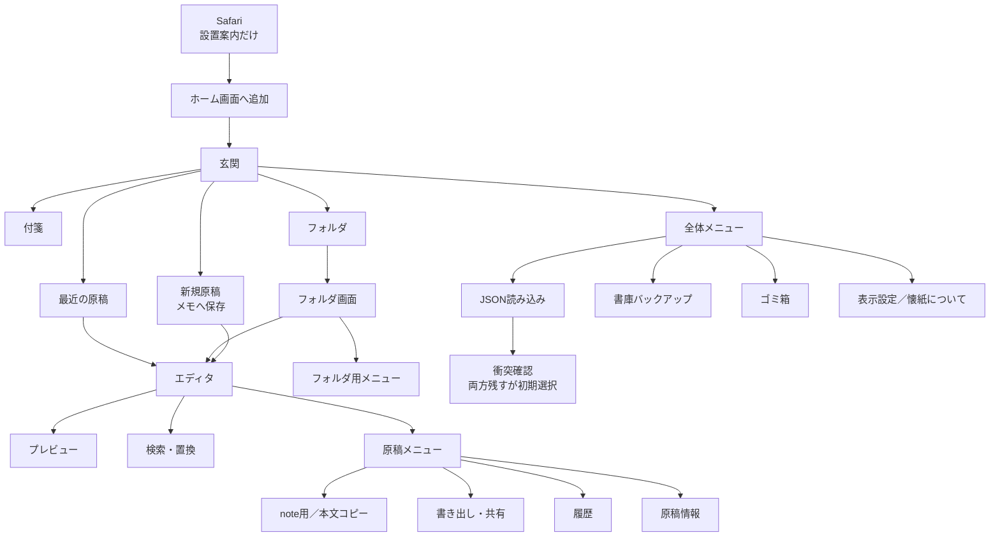
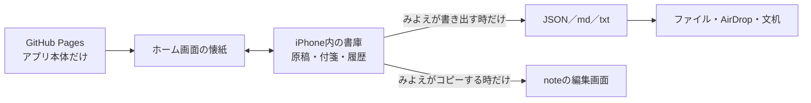

# 懐紙 V1 画面の地図

- 状態: 主要画面の個別確認済み
- 用途: 実装開始前の最終確認
- この文書の時点では、アプリ本体の実装はまだ開始しない

## 入口と主要画面

## 各画面の役割

| 場所 | 主な役割 | 重要な決定 |
|---|---|---|
| Safari | ホーム画面への設置案内 | 書庫・編集・JSON読み込みは開かない |
| 玄関 | 付箋、最近の原稿、フォルダ | 説明文と過剰な余白を避ける |
| 付箋 | 追加、編集、削除、並べ替え | 新規は左端、並べ替えは縦一覧 |
| フォルダ | 下位フォルダと原稿の一覧 | 新規・移動・読込は各グループの先頭 |
| エディタ | 原稿の入力と自動保存 | 本文優先、保存状態を表示 |
| プレビュー | 読み返し | キーボードなし、Markdown記号を隠す |
| 原稿メニュー | 原稿単位の機能 | 危険な操作は一番下へ隔離 |
| 検索・置換 | 原稿内の確認と置換 | 全置換前に履歴、一回のUndoで戻す |
| 履歴 | 最大20世代の確認と復元 | 復元前の現在稿も履歴へ残す |
| 原稿情報 | タイトル、色、保存先 | 記法の種類は切り替えない |
| 書き出し・共有 | `.md`、`.txt`、JSON | 本文用と文机往復用を日本語で分ける |
| JSON読み込み | 原稿、フォルダ、書庫の受入 | 通常は合流、復旧時だけ置き換え |
| 衝突確認 | 両側で変わった原稿の処理 | 「両方残す」が初期選択、一括上書きなし |
| ゴミ箱 | 30日以内の復元 | 原則として元の場所へ戻す |
| 表示設定 | 文字サイズ、行間、余白、書体、明暗 | このiPhoneの全原稿へ共通適用 |
| 書庫バックアップ | 書庫全体JSONの外部保存 | 変更後7日で玄関から案内 |
| 保護画面 | 保存失敗、更新、二重起動 | 未保存の本文を最優先で退避 |

## 原稿データの居場所

- GitHubへ原稿本文を送らない。
- Safariには別の書庫を作らない。
- 公開後はPagesのURLを原則固定する。
- URL変更時は書庫全体JSONで引っ越す。

## 実装へ入った時の順番

1. 日本語入力、端末内保存、note用コピー、共有、オフライン等の危険箇所を小さく試験する。
2. 書庫、固定ID、自動保存、履歴、ゴミ箱、バックアップを作る。
3. 玄関、フォルダ、エディタ、プレビュー等の基本画面を小さく組み立てる。
4. JSON往復、検索・置換、コピー・共有を追加する。
5. みよえのiPhoneへホーム画面版を入れ、文字組み、余白、押しやすさ、長文を実機調整する。

大きな変更の前には、Gitで戻れる保存記録を作る。
